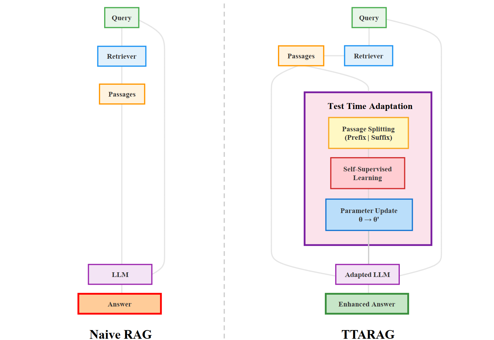

## TTARAG

Code for paper: Predict the Retrieval! Test Time Adaptation for Retrieval Augmented Generation.

### Framework



### Core layout

- `models/`: baselines and TTA implementations (`rag_llama_baseline.py`, `cot_baseline.py`, `icl_baseline.py`, `tta_module.py`, etc.)
- `dataset/`: dataset adapters (`dataset_adapter.py`)
- `prompts/`: evaluation prompt templates
- `local_evaluation.py`: single-process evaluation and debugging
- `parallel_evaluation.py`: parallel evaluation and result saving
- `requirements.txt`: Python dependencies

### Setup

1) Create environment and install dependencies

```bash
python -m venv .venv
. .venv/Scripts/activate  # PowerShell: .venv\Scripts\Activate.ps1
pip install -U pip
pip install -r requirements.txt
```

2) Prepare models and tokenizer

- Generation model: default in `models/config.py` is `config.rag.model_name = "models/Llama-3.1-8B-Instruct"`. Place weights there or override via `--model_name`.
- Sentence embedding model: default `config.rag.embedding_model_name = "models/allMiniLM"`; prepare local weights or adjust.

### Datasets


- CRAG official dataset guide: see `docs/dataset.md` in the CRAG repository for download instructions and schema.
  Link: https://github.com/facebookresearch/CRAG/blob/main/docs/dataset.md

- PubMedQA
  - Loaded by `dataset/PubMedQAAdapter` using `load_dataset("qiaojin/PubMedQA", "pqa_labeled")`
  - Run with: `--dataset pubmedqa --split train`


### Naive-RAG

From the `TTARAG/` folder:

```bash
python parallel_evaluation.py \
  --do_generate \
  --dataset pubmedqa \
  --split train \
  --model_name models/Llama-3.1-8B-Instruct \
  --batch_size 1 \
  --tensor_parallel_size 1 \
  --gpu_memory_utilization 0.85
```

Notes:
- `models/user_config.py` selects the model class (default: `RAGModel`).
- Predictions are saved under `predictions/`, summaries under `results/<dataset>/`.
- To reuse existing predictions, omit `--do_generate` and provide `--predictions_path`.

###  TTArag

`RAGModel` supports TTA and sentence selection via `models/tta_module.py`:

```bash
python parallel_evaluation.py \
  --do_generate \
  --dataset pubmedqa \
  --model_name models/Llama-3.1-8B-Instruct \
  --do_tta \
  --learning_rate 1e-5 \
  --max_adapt_pairs 3 \
  --cross_encoder_name models/ms-marco-MiniLM-L-6-v2
```

See `models/config.py` (`TTAConfig`, `RAGConfig`, `DatasetConfig`) for more knobs; all can be overridden via CLI.


